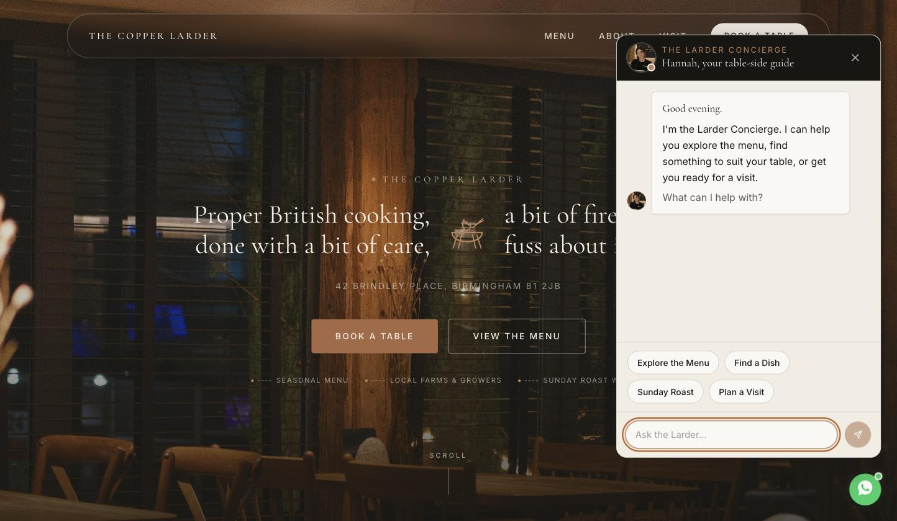
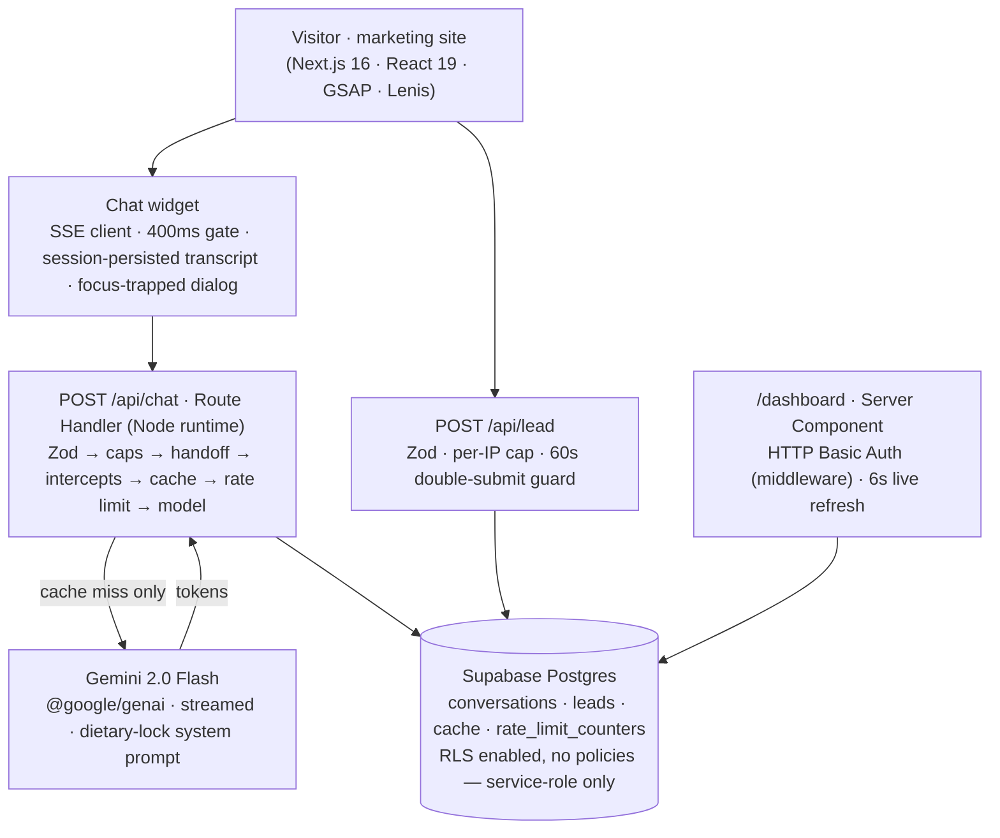
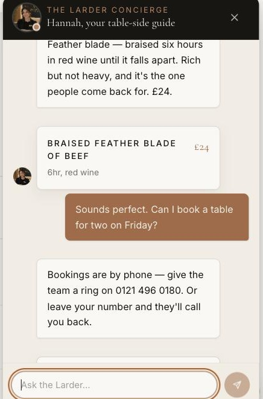
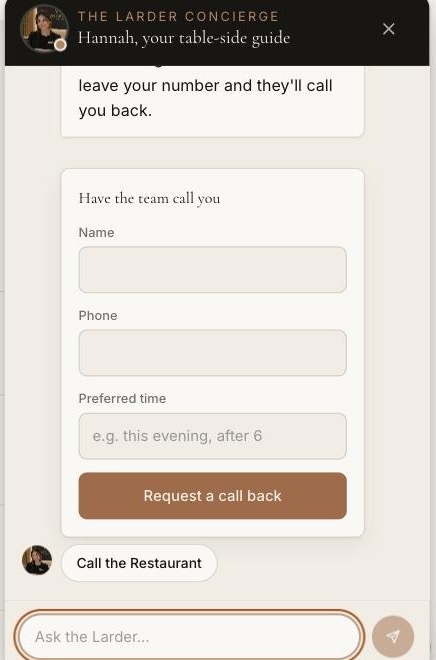

<div align="center">

# The Copper Larder

### An AI front-of-house concierge for hospitality websites

A production-grade, end-to-end reference implementation of a conversational booking
and menu assistant — streamed from the model, grounded in real data, and wrapped in
the cost controls, guardrails and abuse protection a public LLM endpoint actually needs.

[](https://copper-larder.vercel.app)

[](https://nextjs.org)
[](https://react.dev)
[](https://www.typescriptlang.org)
[](https://tailwindcss.com)
[](https://ai.google.dev)
[](https://supabase.com)
[](https://zod.dev)
[](./LICENSE)

<br/>



**[▶ Open the live site](https://copper-larder.vercel.app)**

</div>

---

## What this is

**The Copper Larder** is a modern British bistro. **Hannah**, "the Larder Concierge",
is the AI host that lives on its website: guests chat with her in natural language to
explore the menu, get a recommendation that suits their table, check the practical
details of a visit, or leave a callback request for a booking — and she never leaves
the site to do any of it.

The site is a full marketing experience (cinematic hero, editorial menu, gallery,
reviews, structured data for SEO) and the widget is a complete product: streaming
replies, a proactive time-aware greeting, rich dish/info cards, contextual quick
replies, an inline lead-capture form, and an owner-facing operations dashboard behind
it. Every layer is built to production standards — validation, rate limiting,
guardrails, graceful degradation, accessibility.

> **On the restaurant:** The Copper Larder is a fictional bistro built to carry this
> project. Its menu, branding, address and reviews are sample content. The engineering
> — the pipeline, the guardrails, the data model — is the point of the repo.

---

## Highlights

- **A request pipeline that keeps the model off the critical path.** Five deterministic
  stages run *before* any paid inference — session cap, complaint handoff, a ~19-rule
  regex intercept layer, an exact-match cache, and per-IP + global rate caps. A large
  share of real traffic (hours, parking, "show me the mains", booking) is answered in
  single-digit milliseconds with zero token spend.
- **Server-authored streaming.** Replies stream token-by-token over Server-Sent Events
  from a Next.js Route Handler; the client runs a hand-rolled SSE frame parser with a
  400 ms "thinking" gate so the first beat of every reply lands as a deliberate UX
  moment rather than a flicker.
- **Guardrails that correct the model, not just log it.** A reply that confirms
  availability is caught by regex, *rewritten* with a correction, and blocked from the
  cache so a single bad generation can't become a site-wide answer. Allergy questions
  get a kitchen-deferral disclaimer appended unconditionally.
- **Conversation-wide dietary lock.** "I'm vegan" said in message 2 still constrains
  message 20 — the lock is detected from the *entire* transcript, not the truncated
  window sent to the model, and injected into the system prompt (vegan > gluten-free >
  vegetarian precedence).
- **No hallucination surface in the UI.** Dish cards, info cards and quick replies are
  built only from a single typed restaurant source of truth. The model can surface a
  dish card *only* by naming a dish that actually exists.
- **Abuse protection for an unauthenticated endpoint.** Salted HMAC-SHA-256 IP hashing
  (raw IPs are never stored or logged), spoof-resistant client-IP extraction, Zod-validated
  request bodies, atomic counter RPCs, a double-submit guard and a per-IP cap on the lead
  form, and RLS-locked Postgres where the public key can read nothing.
- **It always degrades gracefully.** Model down, rate-limited, network dropped, key
  missing — every failure path returns a warm, on-brand message with the phone number
  and a callback card. There is no dead end and no stack trace.

---

## The request pipeline

Every message to `POST /api/chat` runs this gauntlet. The first stage that can answer,
does — and only stage 6 costs a token.

| # | Stage | Cost | What it does |
|---|-------|------|--------------|
| 1 | **Validate** | — | Zod schema on body, history capped at 100 turns, message ≤ 500 chars |
| 2 | **Session cap** | — | 20 messages/session → hand off to phone with a callback card |
| 3 | **Handoff detection** | — | Complaint/escalation language → manager-handoff reply, conversation flagged, skips the cheerful path entirely |
| 4 | **Deterministic intercepts** | 0 tokens | ~19 ordered regex rules: hours, address, parking, dietary, menu sections, Sunday roast, group bookings, price objection, booking → phone + callback. Voice matches the model's word-for-word |
| 5 | **Exact-match cache** | 0 tokens | Normalised SHA-256 of the question; served verbatim only early in a conversation, before any accumulated context could make it stale |
| 6 | **Rate caps** | — | Atomic `increment_rate_limit` RPC: 40/IP/day + 200/day global. Consumed **only** on the paid path |
| 7 | **Gemini, streamed** | tokens | `gemini-2.0-flash`, last 6 turns, 300 output tokens, dietary-lock-aware system prompt, streamed over SSE |
| 8 | **Post-processing** | — | Allergy disclaimer append · availability-confirmation catch-correct-and-don't-cache · empty-completion fallback |

---

## Architecture



**Why the model owns nothing.** Availability, prices, the menu, opening hours, parking —
all of it lives in `lib/restaurant.ts` and flows into the prompt, the intercepts, the
landing page, the JSON-LD and the quick-reply system from that one place. The model
composes language around facts it is handed; it is never the source of a fact.

---

## The widget

<div align="center">

&nbsp;&nbsp;

</div>

- **Proactive greeting** — a time-aware bubble ("Good evening — after the menu, or
  planning a visit?") appears once, a few seconds after first paint.
- **Rich cards** — a reply that names a real dish renders a dish card; "where are you?"
  renders an info card. Both are built from typed data, never from model output.
- **Contextual quick replies** — every reply can carry follow-up chips (`See the mains`,
  `Get directions`, `Call the restaurant` as a real `tel:` link).
- **Inline lead capture** — the callback form posts to `/api/lead`, validates client- and
  server-side, guards against double submits, and lands in the dashboard live.
- **Accessible** — `role="dialog"`, `aria-modal`, a real focus trap, `aria-live` on
  streaming text, `prefers-reduced-motion` honoured, full-width bottom sheet on mobile.

---

## Guardrails & safety

| Concern | Mitigation |
|---|---|
| Model confirms a booking it can't | Regex catch on the streamed reply → correction appended → **response never cached** |
| Allergy advice liability | Kitchen-deferral disclaimer appended to every allergy-adjacent reply |
| Dietary preference forgotten mid-chat | Lock detected from the full transcript, injected into the system prompt |
| Prompt-injected menu items / prices | UI cards match against real data only; prompt forbids inventing dishes |
| Cost blowout on a public endpoint | 5 pre-model stages + hard session/IP/global caps; compressed prompt; 6-turn window; 300-token ceiling |
| IP scraping / logging | Salted HMAC hash only; raw IP never persisted; `x-vercel-forwarded-for` trusted, `X-Forwarded-For` de-spoofed |
| Lead-form spam | Zod validation, per-IP daily cap, 60-second double-submit window |
| Data exposure via the anon key | Every table has RLS enabled with **no policies**; all access is server-side with the service-role key |
| Open dashboard | HTTP Basic Auth in `middleware.ts`, active whenever `DASHBOARD_PASSWORD` is set |

---

## Tech stack

| Layer | Choices |
|---|---|
| **Framework** | Next.js 16 (App Router, Turbopack), React 19, TypeScript (strict) |
| **Styling** | Tailwind CSS v4, a hand-authored design-token system, `Cormorant Garamond` + `Inter` |
| **Motion** | GSAP + Lenis for the marketing site; CSS-only for the widget |
| **AI** | Google Gemini 2.0 Flash via `@google/genai`, streamed |
| **Data** | Supabase Postgres — 4 tables, 1 atomic RPC, RLS-locked |
| **Validation** | Zod on every request body |
| **Transport** | Server-Sent Events from a Route Handler; hand-rolled client parser |
| **Deploy** | Vercel |

---

## Getting started

**Prerequisites:** Node 20+, a Supabase project, a Gemini API key.

```bash
git clone https://github.com/Ahmadhsn1/copper-larder.git
cd copper-larder
npm install
cp .env.example .env.local     # fill in the values below
```

**1. Set up the database.** Run [`supabase/migrations/0001_init.sql`](./supabase/migrations/0001_init.sql)
against your Supabase project (SQL editor, or `supabase db push`). It creates the four
tables, the `increment_rate_limit` function, and enables RLS.

**2. Configure the environment** (`.env.local`):

| Var | Where to get it |
|---|---|
| `GEMINI_API_KEY` | [Google AI Studio](https://aistudio.google.com/apikey) |
| `NEXT_PUBLIC_SUPABASE_URL` | Supabase → Project Settings → API |
| `NEXT_PUBLIC_SUPABASE_ANON_KEY` | Supabase → Project Settings → API |
| `SUPABASE_SERVICE_ROLE_KEY` | Supabase → Project Settings → API → `service_role`. Server-only; the app fails closed without it |
| `IP_HASH_SALT` | Any long random string |
| `DASHBOARD_USER` / `DASHBOARD_PASSWORD` | Optional — Basic Auth for `/dashboard` |

**3. Run it.**

```bash
npm run dev     # http://localhost:3000  ·  dashboard at /dashboard
```

This project is deployed on Vercel at **[copper-larder.vercel.app](https://copper-larder.vercel.app)**
— every push to `main` ships. To run your own copy, import the repo on Vercel and set the
same environment variables in the project settings.

---

## Project structure

```
app/
  page.tsx                  Marketing site (hero, menu, about, gallery, reviews, visit)
  layout.tsx                Fonts, smooth scroll, JSON-LD, widget mount
  dashboard/page.tsx        Owner ops view — leads, volume, top questions, flagged chats
  api/chat/route.ts         The request pipeline + streamed Gemini call
  api/lead/route.ts         Callback capture — validation, caps, double-submit guard
components/
  widget/                   Launcher, ChatWindow, Message, CallbackCard, useChat (SSE client)
  hero/ · sections/ · layout/ · ui/ · motion/     Marketing site
  dashboard/LiveRefresh.tsx Interval + focus re-render for the Server Component dashboard
lib/
  restaurant.ts             Single source of truth — menu, hours, location, open status
  prompt.ts                 Hannah's persona + guardrail contract (string builder)
  intercepts.ts             ~19 deterministic zero-API rules + complaint detection
  dietary.ts                Conversation-wide vegan / vegetarian / gluten-free lock
  quickActions.ts           Grounded quick-reply + rich-card contract (shared client/server)
  rate-limit.ts · cache.ts · hash.ts     Caps, exact-match cache, salted IP / question hashing
  supabase.ts               Service-role (server) and anon (browser) clients
  structuredData.ts         Restaurant JSON-LD, built from restaurant.ts
middleware.ts               HTTP Basic Auth gate for /dashboard
supabase/migrations/        Schema
```

---

## Design notes

- **Two visual registers, one system.** The marketing site is dark, cinematic and
  editorial (charcoal / copper / cream, `Cormorant Garamond` display). The widget is a
  calm warm-paper surface. Both are driven by the same token set in `globals.css`.
- **The dashboard is the point of the product.** A booking assistant that doesn't turn
  conversations into a lead the owner can act on is a toy. `/dashboard` shows live lead
  flow, conversation volume, the questions guests ask most (and whether the AI or an
  intercept answered them), and any conversation the handoff detector flagged.
- **Motion with a brake.** Every animation — hero parallax, message fade-up, the
  launcher's breathing pulse — is disabled under `prefers-reduced-motion`.

---

## What this project demonstrates

- Shipping an LLM feature as a **product**, not a prompt: streaming transport, a data
  model, an ops surface, and the failure handling that makes it safe to leave running.
- **Cost and reliability engineering** around a paid, public, unauthenticated model
  endpoint — the layer most demos skip.
- Treating model output as **untrusted**: grounding, output validation, cache poisoning
  prevention, and a UI that can't render a hallucination.
- End-to-end ownership across a **Next.js 16 / React 19** codebase — App Router, Route
  Handlers, Server Components, middleware, SSE, Postgres with RLS, and a design system
  built without a component library.

---

## License

MIT © 2026 Ahmad Hassan — see [LICENSE](./LICENSE).
